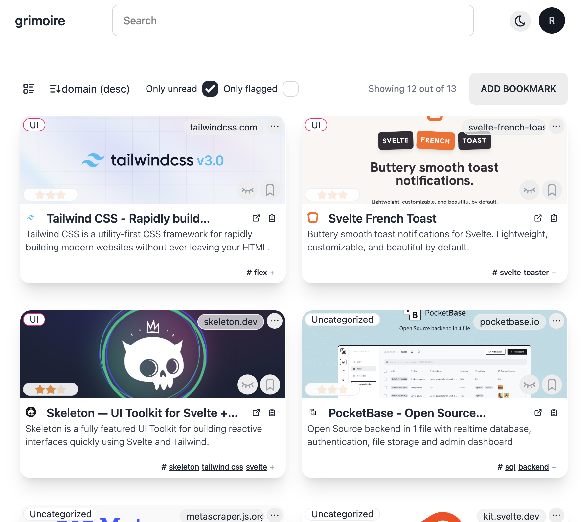
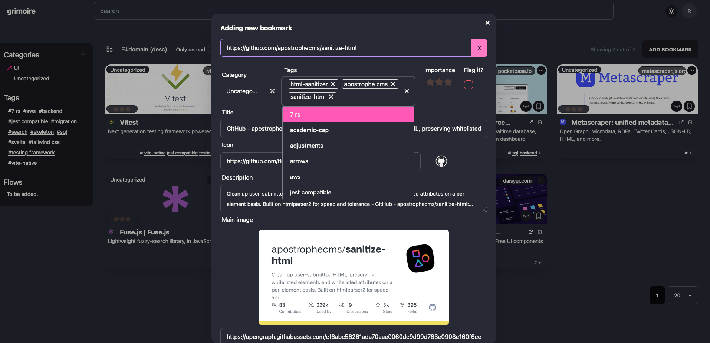
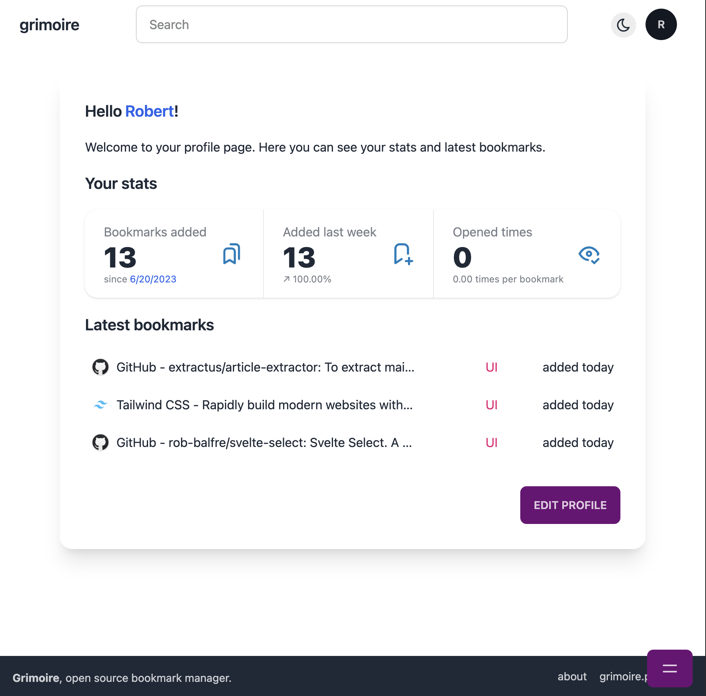
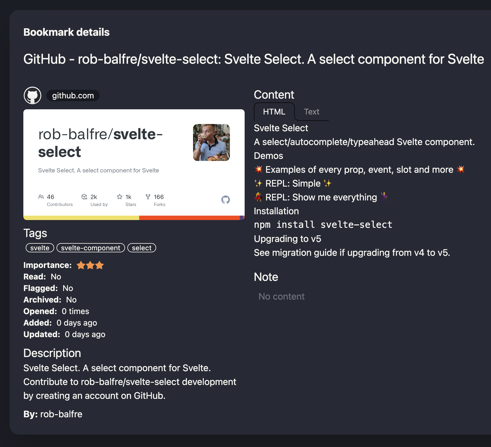

<div align="center">
  
  <h1>Grimoire</h1>
  <p>Bookmark manager for the wizards 🧙</p>


</div>
<br>

> [!IMPORTANT]
> Version `0.4` introduces a new approach for data storage and user authorization. If you are upgrading from version `0.3.X` you may want to utilize the built-in [**migration tool** (read more)](https://grimoire.pro/docs/migration-tool/).

Glimpse into the magical book of _your_ forbidden knowledge - **Grimoire!** 📖💫

Unleash your inner sorcerer and conquer the chaos of bookmarks! With Grimoire, you'll have a bewitching way to store and sort your enchanted links.

But wait, there's **more**!

Transmute your saved pages into juicy content snippets with our mystical extraction feature. Embrace the magic, tame the clutter, and let Grimoire be your mystical companion in the vast library of the web.

It's time to conjure up some organization! 📚✨

## Features

- add and organize bookmarks easily 🔖
- create new user accounts, each with their own bookmarks, categories and tags 🙋
- fuzzy search through bookmarks 🔍
- supports tags and categories 🏷️
- fetch metadata from websites, store it locally and update it when needed 🌐
- add your personal notes to bookmarks 📝
- integration API to add bookmarks from other sources 🧰
- embrace the night with a dark mode 🌙
- and stay productive using our official browser extension, _grimoire companion_ ([available here](https://github.com/goniszewski/grimoire-web-extension)) 🪄

## Screenshots

| Light Mode                                                                      | Dark Mode                                                                            |
| ------------------------------------------------------------------------------- | ------------------------------------------------------------------------------------ |
|  Show only unread              |  Adding new bookmark |
|  User Profile view |  Bookmark details          |

More screenshots can be found in the [screenshots directory](screenshots).

## Installation

<details>
  <summary><strong>Run using Docker Compose</strong> (recommended)</summary>

### Prerequisites

- [Docker](https://docs.docker.com/get-docker/)
- [Docker Compose](https://docs.docker.com/compose/install/)

### Steps

1. Create a `docker-compose.yml` file with the following content:

```yml
services:
  grimoire:
    image: goniszewski/grimoire:develop
    container_name: grimoire
    restart: unless-stopped
    environment:
      - PORT=5173
      - PUBLIC_HTTPS_ONLY=false
      - PUBLIC_SIGNUP_DISABLED=false
    volumes:
      - grimoire_data:/app/data/
    build:
      context: .
      dockerfile: Dockerfile
    healthcheck:
      test: wget --no-verbose --tries=1 --spider http://localhost:$PORT/api/health || exit 1
      interval: 30s
      timeout: 10s
      retries: 3
    ports:
      - '${PORT:-5173}:${PORT:-5173}'
volumes:
  grimoire_data:
```

2. [Optional] Update the environment variables to match your needs.
3. Run the app using `docker compose up -d` command.

</details>

> [!NOTE]
> For the recommended setup, only the `docker-compose.yml` file is required.

<details>
  <summary><strong>Run app using Node</strong></summary>

### Prerequisites

- [Docker](https://docs.docker.com/get-docker/)
- [Docker Compose](https://docs.docker.com/compose/install/)
- [Node.js](https://nodejs.org/en/download/)
- [PNPM](https://pnpm.io/installation)

### Steps

```bash
# Clone the repository
git clone https://github.com/goniszewski/grimoire

# Rename the `.env.example` file to `.env`
# "mv .env.example .env" on Linux/MacOS, "ren .env.example .env" on Windows

# Install the dependencies
pnpm i

# Run the app
chmod +x ./run-dev.sh && ./run-dev.sh
```

</details>

> [!TIP]
> Although the above setups are intended for development, they are also suitable for daily use. For a better experience, it is recommended to use a Node.js process manager, such as [PM2](https://github.com/Unitech/pm2).

## Development

Check out the [development guide](https://grimoire.pro/docs/getting-started/development) to learn how to set up the project for development.

## Roadmap

- [x] Initial relase (0.1.0) 🚀
- [x] Official Docker image 🐳
- [x] Add Integration API 🧰
- [x] Official browser extension ([repository](https://github.com/goniszewski/grimoire-web-extension)) 🪄
- [ ] Bookmark import and export features 💼
- [ ] AI features, like generated descriptions and tags suggestions 🤖
- [ ] Public User profiles & bookmark sharing 🌍
- [ ] Flows - a way to keep bookmarks in a session-like order with related notes (e.g. for learning, research, etc.) ✨
- [ ] ...and more to come! 🧙

We're open to suggestions and feature requests! If you have an idea for a feature, please [open an issue](https://github.com/goniszewski/grimoire/issues) or [start a discussion](https://github.com/goniszewski/grimoire/discussions/categories/ideas).

## Contributing

If you want to contribute to the project, please read the [contributing guide](CONTRIBUTING.md).

## License

This project is licensed under the [MIT License](LICENSE).

## Credits

Special thanks to: [@extractus/article-extractor](https://github.com/extractus/article-extractor),
[Bun](https://github.com/oven-sh/bun),
[DaisyUI](https://github.com/saadeghi/daisyui),
[Drizzle](https://github.com/drizzle-team/drizzle-orm),
[Fuse.js](https://github.com/krisk/fuse),
[Lucia](https://github.com/pilcrowOnPaper/lucia),
[MetaScraper](https://github.com/microlinkhq/metascraper),
[PocketBase](https://github.com/pocketbase/pocketbase),
[sanitize-html](https://github.com/apostrophecms/sanitize-html),
[SvelteKit](https://github.com/sveltejs/kit),
[Svelte Select](https://github.com/rob-balfre/svelte-select),
[Svelte French Toast](https://github.com/kbrgl/svelte-french-toast),
[Swagger UI](https://github.com/swagger-api/swagger-ui),
[Tabler Icons](https://github.com/tabler/tabler-icons),
[Tailwind CSS](https://tailwindcss.com),
[url-metadata](https://github.com/laurengarcia/url-metadata)
