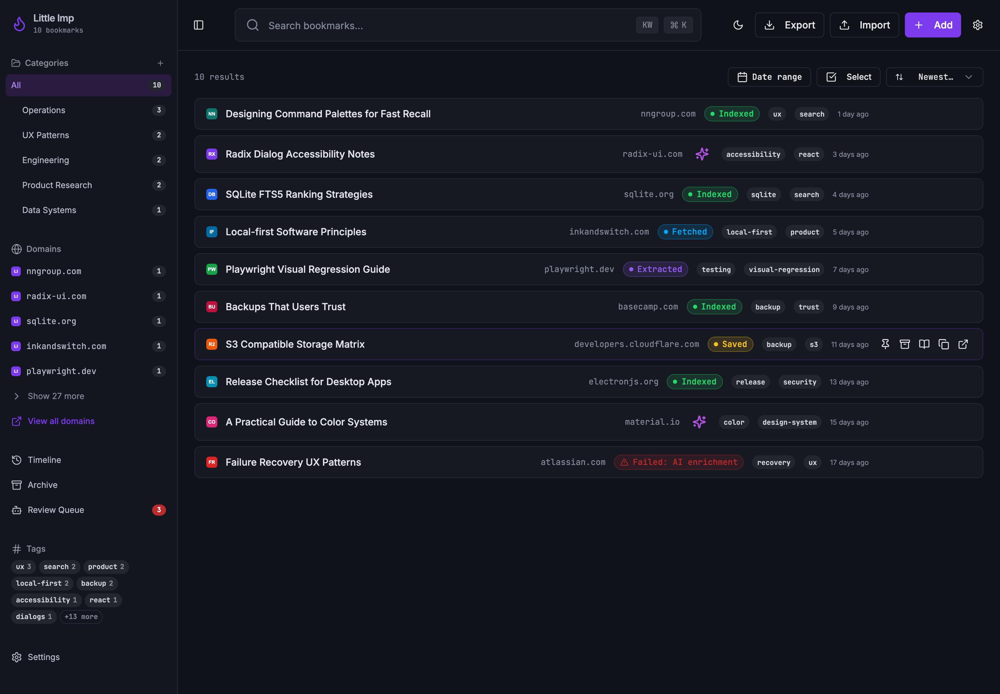
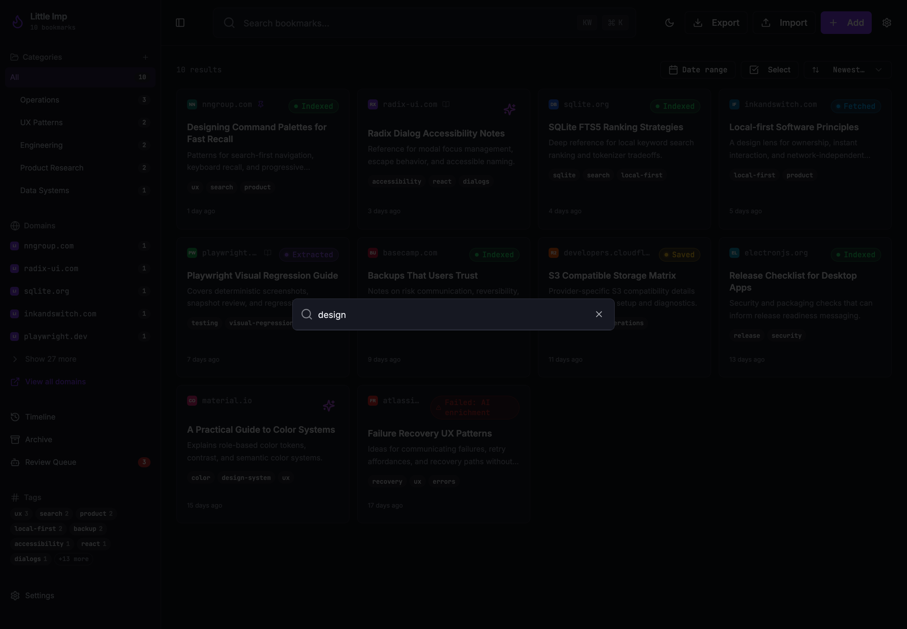
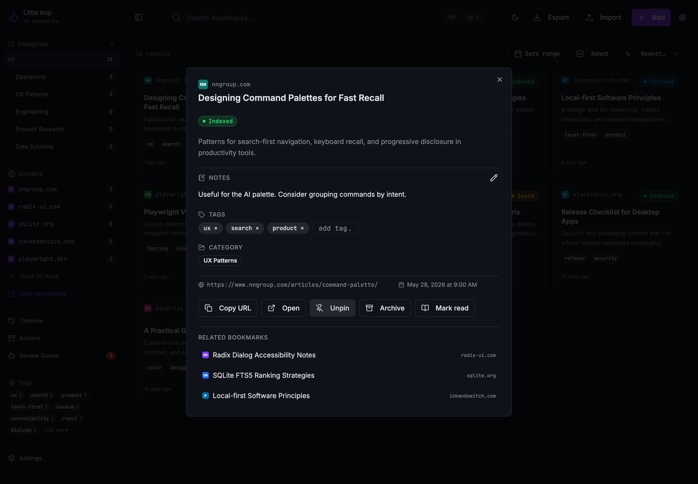
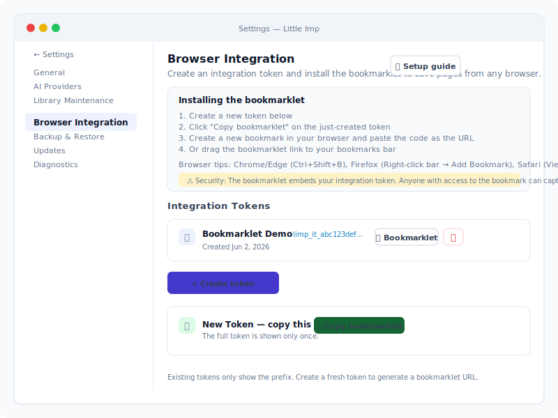
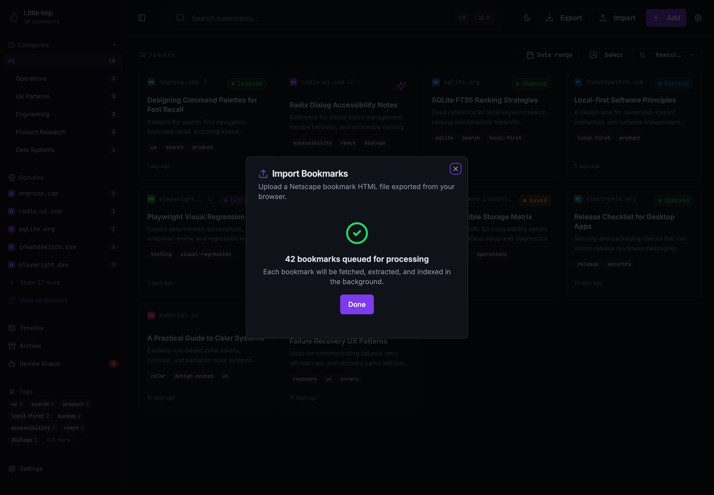
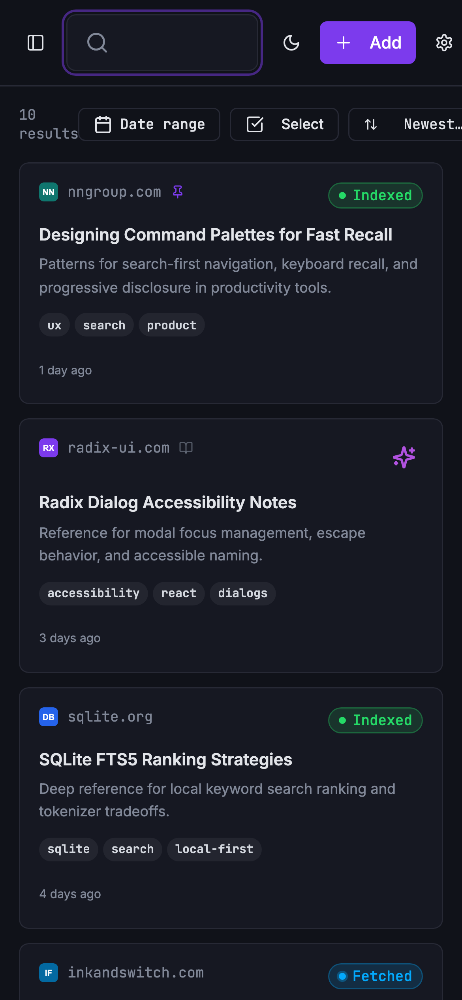

# Little Imp

```text
 _     _ _   _   _        ___
| |   (_) |_| |_| | ___  |_ _|_ __ ___  _ __
| |   | | __| __| |/ _ \  | || '_ ` _ \| '_ \
| |___| | |_| |_| |  __/  | || | | | | | |_) |
|_____|_|\__|\__|_|\___| |___|_| |_| |_| .__/
                                       |_|
```

[](https://github.com/goniszewski/little-imp/actions/workflows/quality.yml)


[](./LICENSE)

Little Imp is a local-first bookmark manager for people who save technical
resources and need to find them later. Save links, import browser bookmarks,
extract readable content, search by keyword or meaning, and let optional AI
providers summarize and organize your library while the data stays on your
machine.

Current release target: `0.1.0-beta`.

> Public install status, June 5, 2026: the repository is still private and the
> unauthenticated tag-qualified installer URL returns `404`. Use the source
> checkout or Docker development paths below for now. The one-command installer
> and Homebrew commands are the intended public paths once distribution
> visibility is unblocked and the release validation tasks pass.

## Contents

- [Screenshots](#screenshots)
- [Quick Start](#quick-start)
- [What Little Imp Does](#what-little-imp-does)
- [How It Works](#how-it-works)
- [Install And Upgrade Paths](#install-and-upgrade-paths)
- [Data, Privacy, And Security](#data-privacy-and-security)
- [Configuration](#configuration)
- [Backups And Restore](#backups-and-restore)
- [Local Integrations](#local-integrations)
- [Development](#development)
- [Documentation](#documentation)
- [Repository Metadata](#repository-metadata)

## Screenshots

The screenshots below use synthetic/demo data from the local UI audit set.

| Library | Search | Bookmark detail |
| --- | --- | --- |
|  |  |  |

| Settings and browser integration | Import flow | Mobile library |
| --- | --- | --- |
|  |  |  |

## Quick Start

### Source Checkout

Use this path while the repository and release artifacts are private.

```sh
git clone https://github.com/goniszewski/little-imp.git
cd little-imp

npm install
cd daemon && bun install
cd ..
```

Start the daemon and frontend in separate terminals:

```sh
npm run daemon:dev
```

```sh
npm run dev
```

Open the Vite app at `http://localhost:5173`. The app talks to the daemon at
`http://127.0.0.1:3210`.

### Docker

Docker serves the built frontend and daemon API from one loopback-bound port.

```sh
docker compose up -d
curl http://127.0.0.1:3210/health
```

Open `http://127.0.0.1:3210`.

### Public Release Installer

This is the intended first-user path after public distribution is unblocked:

```sh
curl -fsSL https://raw.githubusercontent.com/goniszewski/little-imp/v0.1.0-beta/install.sh | bash
```

Do not treat that command as validated while the unauthenticated URL returns
`404`. See [release-decision-v0.1.0-beta.md](./docs/release-decision-v0.1.0-beta.md)
for the current go/no-go state.

## What Little Imp Does

- Saves public `http` and `https` URLs from the app, API, MCP, import flow, or
  browser bookmarklet.
- Extracts readable content from normal web pages, PDFs, GitHub repositories,
  GitHub issues, StackOverflow/StackExchange pages, and YouTube
  metadata/transcripts where available.
- Stores bookmarks, content, tags, categories, jobs, notes, timeline events,
  backups, and settings locally in SQLite and local files.
- Searches with SQLite FTS5 keyword search, semantic embedding search, or a
  hybrid ranking mode.
- Supports archive, trash, read state, read-later flags, pinning, notes,
  category/tag management, import/export, backup/restore, diagnostics, and
  local update checks.
- Runs without AI providers. Optional providers include OpenAI, Ollama,
  Anthropic, OpenRouter, DeepSeek international, and custom OpenAI-compatible
  chat or embeddings endpoints.

## How It Works

Little Imp has two runtime parts:

- Frontend: React 18, Vite, TypeScript, Tailwind, and shadcn/Radix UI under
  `src/`.
- Daemon: Bun, Hono, and SQLite under `daemon/`, listening on
  `127.0.0.1:3210` by default.

Bookmark ingestion is progressive:

```text
save URL
  -> enqueue durable SQLite job
  -> fetch public content
  -> extract readable text and metadata
  -> enrich with optional AI summary, tags, and category
  -> create optional embeddings
  -> update search indexes
```

Bookmarks are visible immediately after save. Pipeline failures keep the
bookmark usable and expose retry/reprocess controls.

## Install And Upgrade Paths

### Native Source Install

The source installer copies daemon files, installs production dependencies,
builds the frontend, writes a default config, registers the user service, and
starts the daemon.

```sh
cd daemon
./install.sh
```

Upgrade from an unpacked source checkout or release archive:

```sh
cd daemon
./install.sh --upgrade
```

Uninstall while preserving data:

```sh
cd daemon
./install.sh --uninstall
```

Purge data only when you intentionally want to remove the local library:

```sh
cd daemon
./install.sh --uninstall --purge
```

### Homebrew alternate install

Homebrew is an alternate MVP install path for macOS and Linux users who prefer
`brew services`. It remains gated on public release artifacts being reachable
and live validation passing.

```sh
brew tap oven-sh/bun
brew tap goniszewski/little-imp
brew install little-imp
brew services start little-imp
```

Upgrade and service management:

```sh
brew update
brew upgrade little-imp
brew services restart little-imp

brew services stop little-imp
brew uninstall little-imp
```

Data is preserved by default under `$(brew --prefix)/var/little-imp` when
running `brew uninstall little-imp`. Remove that directory explicitly only when
you intend to purge the Homebrew-managed database, settings, backups, and logs.

Current local formula checks pass, but live `brew install` is still blocked by
public artifact `404` while the repository is private.

## Data, Privacy, And Security

Native installs keep user data under `~/.local/share/littleimp/`.

| Path | Contents |
| --- | --- |
| `~/.local/share/littleimp/littleimp.db` | SQLite database |
| `~/.local/share/littleimp/.env` | Install-time daemon defaults |
| `~/.local/share/littleimp/dist/` | Built frontend served by the daemon |
| `~/.local/share/littleimp/backups/` | Local snapshots and encrypted packages |
| `~/.local/share/littleimp/restore-rollbacks/` | Pre-restore rollback copies |
| `~/.local/share/littleimp/logs/` | Daemon logs |

Runtime user settings live at `~/.config/littleimp/config.json`. Homebrew
installs keep Homebrew-managed data under `$(brew --prefix)/var/little-imp`.

Little Imp is local-first and loopback-first:

- Native daemon default: `127.0.0.1:3210`.
- Docker host port default: `127.0.0.1:3210:3210`.
- General REST routes are intended for first-party loopback use.
- MCP and protected capture endpoints require managed local integration bearer
  tokens.
- Public-network exposure is not a supported mode for `0.1.0-beta`; put an
  authenticated tunnel, VPN, or reverse proxy in front of it if you deliberately
  need remote access.

See [SECURITY.md](./SECURITY.md) and
[security-boundaries.md](./docs/security-boundaries.md).

## Configuration

The daemon reads install-time defaults from `~/.local/share/littleimp/.env`.

| Variable | Default | Description |
| --- | --- | --- |
| `HOST` | `127.0.0.1` | Bind address. Keep localhost for security. |
| `PORT` | `3210` | Daemon HTTP port. |
| `DATA_DIR` | `~/.local/share/littleimp` | Database, backups, and logs. |
| `NODE_ENV` | `production` | Use `development` for local development logging. |
| `LOG_FORMAT` | `json` | `json` or `pretty`. |

AI and embedding settings are managed in Settings and persisted in
`~/.config/littleimp/config.json`. Secret fields are redacted in API responses,
diagnostics, and portable settings backups.

## Backups And Restore

Settings and the packaged `littleimp` CLI can create, verify, encrypt, and
restore local backup snapshots. Each normal snapshot contains:

- `snapshot.db`
- `manifest.json`
- `checksums.sha256`
- `data/settings.json`

CLI examples:

```sh
littleimp backup create
littleimp backup list
littleimp backup verify --file ~/.local/share/littleimp/backups/BACKUP_NAME
littleimp backup restore BACKUP_NAME --yes
```

Encrypted package examples:

```sh
LITTLEIMP_BACKUP_PASSWORD='use-a-long-unique-password' \
  littleimp backup create --encrypt --output ~/Desktop/little-imp-backup.enc

LITTLEIMP_BACKUP_PASSWORD='use-a-long-unique-password' \
  littleimp backup verify --encrypted --file ~/Desktop/little-imp-backup.enc
```

Restores verify checksums, create a rollback directory, replace local data, and
return a restart command plus `/health` URL. See
[backup-design.md](./docs/backup-design.md).

## Local Integrations

### REST API

The generated API reference is [API.md](./API.md). The source contract is
[docs/api-contract.json](./docs/api-contract.json), generated from
`daemon/src/api/contract.ts`.

```sh
curl http://127.0.0.1:3210/health
```

### MCP

Little Imp exposes Streamable HTTP MCP at `http://127.0.0.1:3210/mcp`. Create
a local integration token first:

```sh
curl -X POST http://127.0.0.1:3210/integration-tokens \
  -H "Content-Type: application/json" \
  -d '{"name":"Local MCP client"}'
```

Use the returned token as `Authorization: Bearer ...`.

### Browser Bookmarklet

Settings -> Browser Integration can create a token-backed bookmarklet. Drag it
to your browser bookmarks bar, then click it on a page to capture the current
URL, title, and selected text into Little Imp.

The bookmarklet embeds an integration token. Treat it like a password.

## Development

```sh
npm install
cd daemon && bun install
cd ..
```

Core commands:

```sh
npm run dev
npm run daemon:dev
npm run lint
npm run type-check
npm run test
npm run test:daemon
npm run test:e2e
npm run build
```

Full local quality gate:

```sh
npm run check
```

If `node`, `npm`, `npx`, or `bun` are missing in a sandboxed environment, run:

```sh
npm run tools:setup
export PATH="$PWD/local/bin:$PATH"
```

Then rerun the normal commands.

## Documentation

- [FAQ](./docs/faq.md)
- [API Reference](./API.md)
- [API Contract](./docs/api-contract.json)
- [Project Overview](./docs/overview.md)
- [Product Requirements](./docs/prd.md)
- [Roadmap](./docs/roadmap.md)
- [Backup Design](./docs/backup-design.md)
- [Diagnostics](./docs/diagnostics.md)
- [Docker Deployment](./docs/docker-deployment.md)
- [Update System](./docs/update-system.md)
- [Release Notes](./docs/release-notes-v0.1.0-beta.md)
- [Release Decision](./docs/release-decision-v0.1.0-beta.md)
- [Release Checklist](./docs/release-checklist.md)
- [Security Policy](./SECURITY.md)
- [Contributing Guide](./CONTRIBUTING.md)
- [Task Board](./tasks/README.md)
- [Task Reports](./docs/task-reports/index.html)

## Repository Metadata

Recommended GitHub settings for public visibility:

- Description: `Local-first bookmark manager with content extraction, semantic search, optional AI enrichment, backups, and local integrations.`
- Homepage: leave blank until a product site exists, or use the GitHub repository URL.
- Topics: `bookmark-manager`, `local-first`, `sqlite`, `bun`, `hono`,
  `react`, `vite`, `typescript`, `semantic-search`, `llm`, `mcp`,
  `backup`, `self-hosted`.

## Changelog

See [CHANGELOG.md](./CHANGELOG.md).

## License

MIT. See [LICENSE](./LICENSE).
