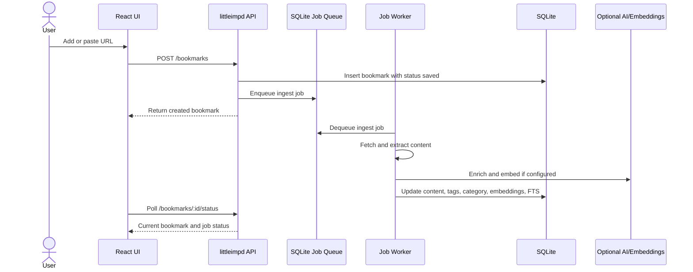
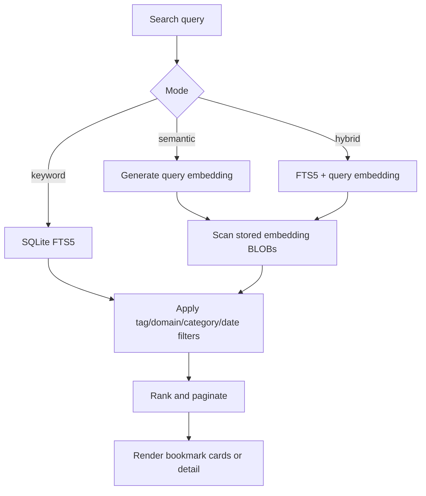
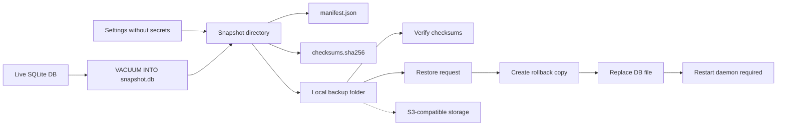
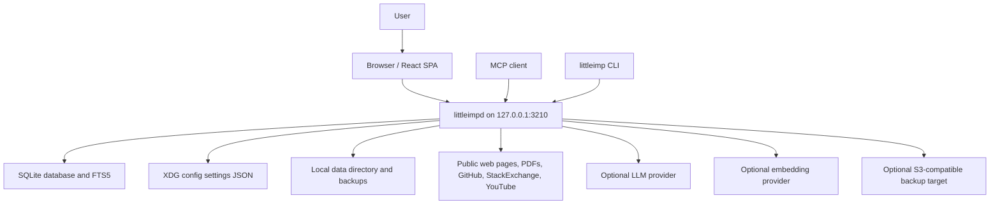
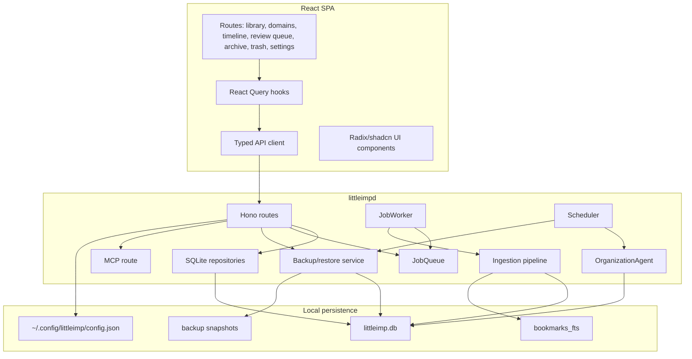
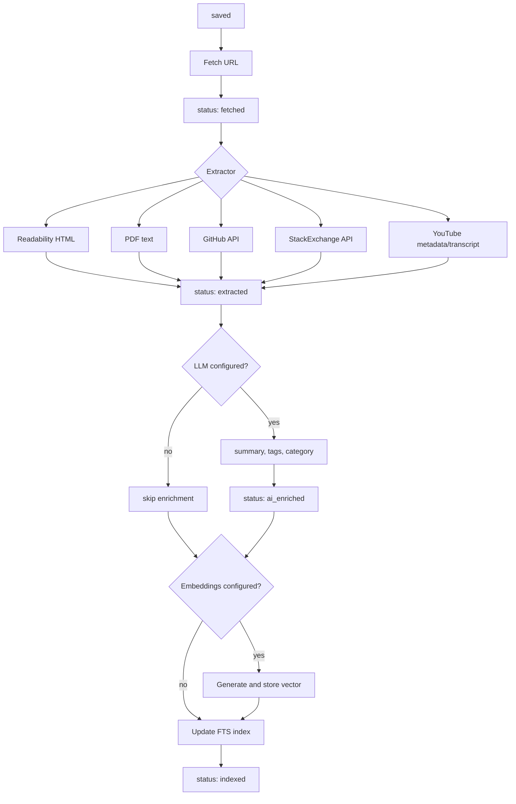
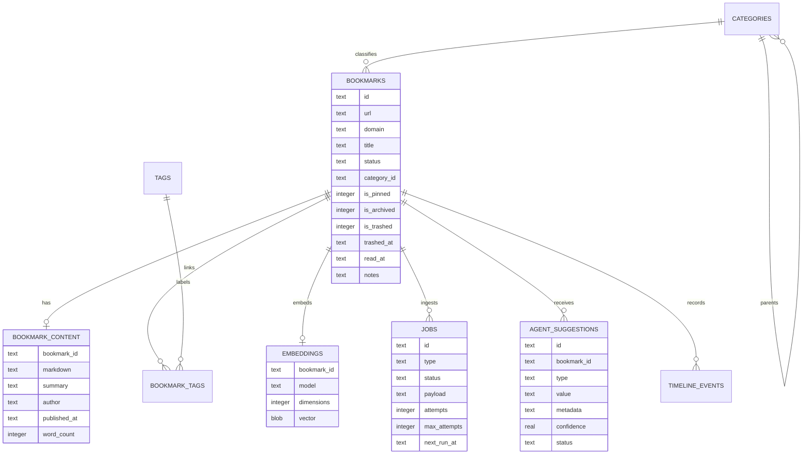

# Little Imp Overview

Version: `0.1.0-beta`
Status: current implementation overview
Last updated: May 2026

## Purpose

Little Imp is a local-first personal knowledge index for saved web resources. It is designed for developers who collect technical articles, documentation, videos, repositories, discussions, PDFs, and other reference material, then need to find those items later by meaning rather than by remembering the exact title.

The product promise is:

> Find anything you have saved quickly. Organization happens automatically where possible.

Little Imp has two runtime parts:

- A React single-page app for the user interface.
- `littleimpd`, a Bun and Hono daemon that owns storage, background processing, API routes, backup, MCP, and static production serving.

## Core Features

### Bookmark Capture

Users can save public `http` or `https` URLs from the add dialog, by pasting a URL into the main page, through browser bookmark import, through the REST API, or through the MCP tool endpoint.

Implemented behavior:

- URL validation rejects invalid schemes and private or loopback hosts.
- Duplicate active URLs return the existing bookmark idempotently.
- URLs already in Archive or Trash return a conflict so the user can restore or permanently remove the existing record.
- New bookmarks are visible immediately with status `saved`, then processed asynchronously.
- The ingestion pipeline is durable because jobs are stored in SQLite and recovered after daemon restart.

### Content Extraction

The daemon fetches saved URLs and selects an extractor by URL and content type.

| Source | Extraction approach |
|---|---|
| Normal web pages | Lightweight readability-style HTML cleanup and Markdown conversion |
| PDFs | `pdf-parse` text extraction from fetched PDF bytes |
| GitHub repositories | GitHub REST API metadata plus README content |
| StackOverflow and StackExchange | Stack Exchange API question and accepted or top answer |
| YouTube | oEmbed metadata plus available caption transcript |

The pipeline falls back gracefully where possible. A failed fetch leaves the bookmark saved for retry. A failed extraction stores minimal title/content. Failed AI or embedding calls do not make the bookmark unusable.

### AI Enrichment

When an LLM provider is configured, the pipeline enriches extracted content with:

- a concise summary
- generated tags
- a broad category such as `Article`, `Tutorial`, `Documentation`, `Tool`, `Library`, `Video`, `Discussion`, `News`, or `Other`

Supported LLM providers are OpenAI, Ollama, Anthropic via the Messages API, OpenRouter, custom OpenAI-compatible chat endpoints, DeepSeek international, and `none`. Embeddings support OpenAI, Ollama, and a separate custom OpenAI-compatible embeddings endpoint. The app can run with no usable LLM provider; the UI displays degraded mode instead of blocking core bookmark use.

### Search And Discovery

Search is the main interaction model.

| Mode | Implementation | Requirements |
|---|---|---|
| Keyword | SQLite FTS5 over title, summary, tags, and extracted content | Always available after indexing |
| Semantic | Query embedding compared with stored bookmark embeddings | Embedding provider configured |
| Hybrid | Weighted keyword, vector, and recency scoring | Embedding provider configured |

Hybrid scoring currently combines keyword relevance, cosine similarity, and recency:

```text
hybrid_score = keyword_score * 0.6 + vector_score * 0.3 + recency_score * 0.1
```

Search and listing support filtering by tag, domain, category, and date range. Related bookmarks use stored embeddings for similarity.

### Library Organization

Little Imp supports both manual and automated organization.

Manual controls:

- create, rename, delete, and reparent categories
- drag and drop categories up to three nesting levels
- edit bookmark title, tags, category, notes, pin state, archive state, and read state
- filter by category, tag, domain, and date
- bulk delete and bulk move selected bookmarks

Automated controls:

- LLM-generated summaries, tags, and categories during ingestion
- a periodic organization agent that detects duplicate bookmarks and similar categories
- pending suggestions reviewed in the Review Queue
- high-confidence duplicate/category actions auto-applied and recorded in the timeline

### Lifecycle Views

The app separates bookmark states intentionally:

- Active library: normal searchable bookmarks.
- Archive: user-hidden bookmarks that remain restorable and are not auto-purged.
- Trash: soft-deleted bookmarks that can be restored or permanently deleted.
- Permanent delete: hard deletion from Trash only.

Trash is purged by a scheduled daemon task after 30 days.

### Import, Export, And Backups

Data movement features:

- Netscape bookmark HTML import with server-sent progress events.
- JSON and CSV export for active bookmarks with optional filters.
- Portable local backup snapshots containing `snapshot.db`, `manifest.json`, `checksums.sha256`, and non-secret settings.
- In-app backup verification without restore.
- Restore with checksum verification, rollback directory creation, and `restart_required: true`.
- Custom local backup folders, scheduled snapshots, retention, and S3-compatible remote targets.
- Settings encrypted package creation for listed local backup snapshots.
- Packaged `littleimp` CLI backup commands, including encrypted package create, verify, and restore.

For detailed backup behavior, see [backup-design.md](./backup-design.md).

### Local Operations And Integrations

Supported run modes:

- Native daemon install through `daemon/install.sh` on macOS LaunchAgent or Linux systemd user units.
- Docker deployment serving both frontend and daemon API from a loopback-bound port.
- Development with Vite frontend and a Bun daemon.
- Manual update availability checks through Settings, `littleimp update check`, and `GET /updates/check`; the packaged CLI also supports explicit verified native upgrades with `littleimp update install`.

Integration points:

- REST API on `http://127.0.0.1:3210`.
- Generated API documentation in [../API.md](../API.md).
- Source API contract in `daemon/src/api/contract.ts`.
- Streamable HTTP MCP endpoint at `/mcp` with tools for bookmark search, reading, listing, creation, and category listing.

## User Flows

### Save A Bookmark

1. User adds or pastes a public URL.
2. Frontend posts to `POST /bookmarks`.
3. Daemon validates the URL and creates a `bookmarks` row.
4. Daemon enqueues an `ingest` job.
5. UI immediately shows the bookmark.
6. Worker fetches, extracts, enriches, embeds, and indexes in the background.
7. The detail view and pipeline badge reflect progress.



### Search The Library

1. User types into the search bar.
2. UI debounces input and calls `GET /search`.
3. Keyword mode runs an FTS5 query.
4. Semantic mode embeds the query and scores stored vectors.
5. Hybrid mode combines FTS, vector similarity, and recency.
6. UI renders results with filters and sorting.



### Review AI Suggestions

1. The scheduler runs the organization agent periodically.
2. The agent checks active bookmark count and embedding availability.
3. It scans embeddings for duplicates and similar category clusters.
4. High-confidence actions are applied directly.
5. Lower-confidence actions are written to `agent_suggestions`.
6. User accepts or rejects suggestions in the Review Queue.
7. Accepted actions and user decisions are written to the timeline.

### Back Up And Restore

1. User creates a backup from Settings, CLI, or `POST /backup`.
2. Daemon creates a SQLite-consistent snapshot with `VACUUM INTO`.
3. Daemon writes non-secret settings, manifest, and checksums.
4. Optional S3 upload copies the same snapshot layout to remote storage.
5. User can verify the backup without restoring.
6. Restore validates manifest and checksums, creates a rollback copy, replaces the database, restores non-secret settings, and returns restart, health, and rollback guidance.



## Architecture

### System Context



### Runtime Components



### Ingestion Pipeline



### Data Model



## Key Design Decisions

| Area | Decision | Reason |
|---|---|---|
| Deployment model | Localhost daemon plus static/frontend SPA | Keeps data local while allowing a normal browser UI |
| Persistence | SQLite with WAL, migrations, FTS5, and BLOB embeddings | Simple local install, durable queue, good enough search without external services |
| AI | Optional provider configuration | Core features still work offline or without API keys |
| Pipeline | Async job worker | Saving is fast; thrown job failures retry through the queue; optional provider stages use internal transient retries and do not block indexing after final failure |
| Backup | Portable snapshot directories | Easy to verify, inspect, copy, upload, and restore |
| Remote backup | S3-compatible target first | Broad provider support without custom integrations per cloud vendor |
| External integrations | MCP over stateless Streamable HTTP | Allows local assistants and tools to use the bookmark library without exposing a public API |

## Limitations And Non-Goals

### Product Scope

- Little Imp is single-user and local-first.
- It is not a public hosted service and does not implement multi-user accounts.
- Live multi-device sync is not implemented. Backups are snapshots, not replication.
- A browser extension and install-without-clone distribution polish are future work.

### Security Model

- The daemon API has no authentication layer.
- The supported network posture is loopback-only, typically `127.0.0.1:3210`.
- Docker examples intentionally bind the host port to `127.0.0.1`.
- Public reverse-proxy deployment requires an external authenticated tunnel, VPN, or reverse proxy.
- The in-app lock is a local browser convenience, not daemon-level access control.

### AI And Search

- LLM enrichment, semantic search, related bookmarks, and the organization agent require configured providers.
- Semantic search stores float32 vectors in SQLite BLOBs and scans them in process. There is no ANN index yet.
- `sqlite-vec` or another vector index remains a future optimization.
- The organization agent skips analysis with fewer than 20 active bookmarks.
- Duplicate detection skips libraries above 2,000 embeddings to avoid expensive O(n squared) scans.

### Extraction

- Fetching is limited to public hosts, 20 seconds, 10 MB response bodies, and HTML/PDF content types.
- Raw HTML stored in SQLite is capped at 500 KB.
- PDF extracted text is capped at 500,000 characters and scanned/image-only PDFs may only preserve metadata.
- GitHub and StackExchange extractors use public APIs and inherit their unauthenticated rate limits unless tokens are supplied.
- YouTube transcripts depend on caption availability and YouTube response formats.

### Backup And Restore

- Restore replaces the local database, reports the restart command and rollback instructions, and requires daemon restart.
- Settings backups omit secrets; restore preserves the current local API keys, app lock secret, and S3 credentials.
- Backup scheduling reads live enable/disable settings, but the scheduler interval itself is initialized at daemon startup.
- Encrypted backup packages can be created from Settings for listed local backups; Settings can verify or restore package files under the configured backup folder, and the CLI can verify or restore arbitrary package paths available to the user shell.

## Primary Files

| Area | Files |
|---|---|
| React routing | `src/App.tsx` |
| Frontend API client | `src/lib/api.ts` |
| Bookmark UI state | `src/hooks/use-bookmarks.ts` |
| Daemon app and startup | `daemon/src/server.ts`, `daemon/src/index.ts` |
| API contract | `daemon/src/api/contract.ts`, `docs/api-contract.json`, `../API.md` |
| Bookmark routes/repositories | `daemon/src/routes/bookmarks.ts`, `daemon/src/db/bookmark-repository.ts` |
| Search | `daemon/src/routes/search.ts`, `daemon/src/db/search-repository.ts` |
| Pipeline | `daemon/src/pipeline/pipeline.ts`, `daemon/src/pipeline/extractor.ts` |
| AI and embeddings | `daemon/src/ai/enrichment.ts`, `daemon/src/ai/embeddings.ts`, `daemon/src/runtime-settings.ts` |
| Organization agent | `daemon/src/ai/organization-agent.ts`, `daemon/src/routes/suggestions.ts` |
| Backup/restore | `daemon/src/routes/backup.ts`, `daemon/src/backup/` |
| Settings | `daemon/src/settings.ts`, `src/pages/Settings.tsx` |
| MCP | `daemon/src/mcp/server.ts`, `daemon/src/routes/mcp.ts` |

## Related Documents

- [Product requirements](./prd.md)
- [Roadmap](./roadmap.md)
- [Backup design](./backup-design.md)
- [Docker deployment](./docker-deployment.md)
- [Update system design](./update-system.md)
- [Release checklist](./release-checklist.md)
- [Generated API documentation](../API.md)
